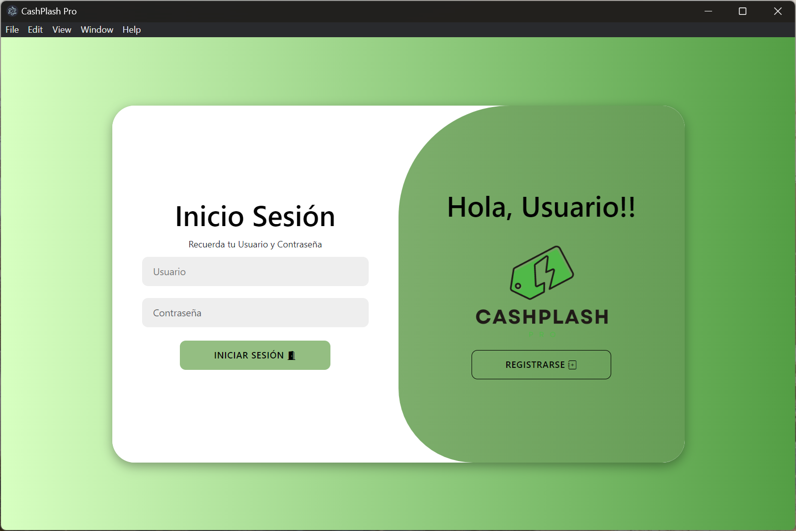
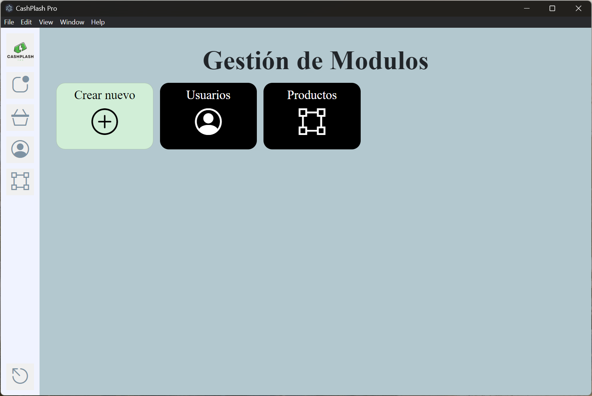
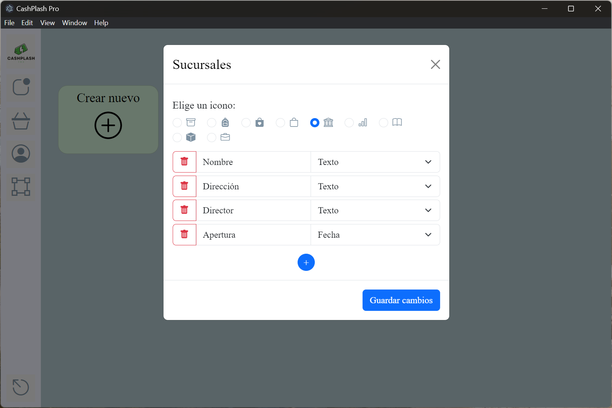

# CashPlash_Pro


El Proyecto CashPlah_Pro es una solución integral diseñada para facilitar la administración de pequeños y medianos negocios. Esta aplicación de escritorio permite a los usuarios gestionar de manera eficiente el inventario de la tienda, realizar ventas y gestionar usuarios con acceso a la plataforma. Su interfaz intuitiva y flexible permite una personalización adaptada a las necesidades específicas de cada comercio.

Una de las características más destacadas de esta aplicación es su capacidad de personalización. Los usuarios pueden agregar nuevos módulos al sistema a través de una interfaz dedicada, permitiendo la adaptación de la aplicación a las necesidades específicas de cada negocio.

## ✨ Demo

### Enlace
[https://github.com/MelchorRuiz/CashPlash_Pro/releases/tag/v1.0.0](https://github.com/MelchorRuiz/CashPlash_Pro/releases/tag/v1.0.0)

### Acceso
- Usuario: root
- Contraseña: root


## 🖥️ Ejecución en un entorno local

Clona el proyecto

```bash
  git clone https://github.com/MelchorRuiz/CashPlash_Pro
```

Ve al directorio del proyecto

```bash
  cd CashPlash_Pro
```

Instala las dependencias

```bash
  npm install
```

Crea la variable de entorno necesaria con tu uri de conexión para Mongo DB

```bash
  echo 'MONGODB_URI="tu_uri_de_conexión_para_Mongo_DB"' > .env
```

Inicia la aplicación

```bash
  npm start
```


## 🖼️ Screenshots

|  |  |
| --- | --- |
|  |  |

Proyecto CashPlash_Pro, elaborado en la Universidad Tecnológica de León durante mis estudios en TSU Desarrollo de Software Multiplataforma
